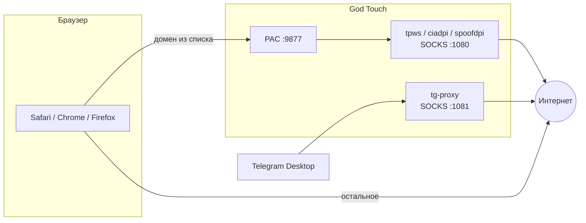

<div align="center">

# God Touch

**Menubar-приложение для macOS — обход DPI и прокси для Telegram**


Иконка в строке меню → **CONNECT** → YouTube, Discord, Twitch и другие сайты из списка идут через обход DPI.  
Telegram — отдельный SOCKS-прокси. Остальной трафик — напрямую.

[Быстрый старт](#-быстрый-старт) · [Установка](#-установка) · [Интерфейс](#-интерфейс) · [Настройка DPI](#-настройка-dpi) · [Под себя](#-настройка-под-себя) · [FAQ](#-частые-проблемы)

</div>

---


## Содержание

- [Быстрый старт](#-быстрый-старт)
- [Установка](#-установка)
- [Интерфейс](#-интерфейс)
- [Настройка DPI](#-настройка-dpi)
- [Настройка под себя](#-настройка-под-себя)
- [Архитектура](#-архитектура)
- [Ветки репозитория](#-ветки-репозитория)
- [Частые проблемы](#-частые-проблемы)

---

## ⚡ Быстрый старт

> **30 секунд:** menubar → **CONNECT** → **CFG** → **SCAN** → готово.

### Чеклист

- [ ] `Touch.app` установлен в `/Applications`
- [ ] Иконка в menubar, приложение запущено
- [ ] Нажал **CONNECT** — в статусе `ENG: …`
- [ ] **CFG → SCAN** — подобрана стратегия
- [ ] Telegram подключил SOCKS `127.0.0.1:1081`
- [ ] В браузере включён Secure DNS (DoH)

### Иконка в menubar

| Состояние | Вид |
|-----------|-----|
| Выключено | серая CRT-иконка |
| CONNECT активен | янтарная иконка со искрой |

### Что делает Touch

| | |
|---|---|
| Обход DPI | YouTube, Discord, Twitch и др. из списка доменов |
| SOCKS `:1080` | DPI-движок для браузера |
| PAC `:9877` | Только нужные домены → прокси, остальное — напрямую |
| SOCKS `:1081` | Отдельный прокси для Telegram Desktop |
| Фон | Работает в menubar, не трогает весь трафик |

### Требования

- macOS **14+** (Sonoma и новее)
- **Apple Silicon** (M1 / M2 / M3 / M4)
- Интернет при первой сборке (~15 мин)
- Xcode CLT, Homebrew, Go, Rust

---

## 📦 Установка

### Шаг 1 — инструменты (один раз)

```bash
xcode-select --install
/bin/bash -c "$(curl -fsSL https://raw.githubusercontent.com/Homebrew/install/HEAD/install.sh)"
brew install go rust
```

### Шаг 2 — скачать и собрать

```bash
git clone https://github.com/RSAM1K/GodTouch.git
cd GodTouch
chmod +x scripts/build.sh
./scripts/build.sh
```

> Первая сборка долгая — скрипт сам скачает и соберёт `tpws`, `spoofdpi`, `tg-proxy`.  
> Результат: **`/Applications/Touch.app`**

### Шаг 3 — запуск

```bash
open /Applications/Touch.app
```

### Обновление

```bash
cd ~/Projects/GodTouch   # или твой путь
git pull
./scripts/build.sh
```

### Удаление

1. **DISCONNECT** → **EXIT** в панели
2. Удали `/Applications/Touch.app`
3. Системные настройки → Сеть → убери авто-прокси, если остался

---

## 🖥 Интерфейс

### Главная панель


| | Элемент | Описание |
|---|---------|----------|
| **1** | God Touch | Заголовок, версия справа |
| **2** | Терминал-арт | `ENG: tpws · general` — активный движок. `TG ✓` — Telegram жив |
| **3** | CONNECT | Включает / выключает всё. Во время работы — **ABORT** |
| **4** | CFG | Настройки: стратегия, SCAN, PING, автозапуск |
| **5** | EXIT | Выключает и закрывает приложение |
| **6** | TG proxy pending | Telegram не настроен → нажми **OPEN** |

<br clear="all">

### Панель CFG


| | Раздел | Описание |
|---|--------|----------|
| **A** | СИСТЕМА | Запуск при входе, CONNECT при старте |
| **B** | АВТО | Режим по умолчанию — SCAN подбирает стратегию |
| **C** | SCAN | ~20 комбинаций движков, сохраняет лучшую |
| **D** | PING | YouTube, Google, Discord, Twitch, Telegram |
| **E** | ВРУЧНУЮ | Пресеты и свои флаги — для опытных |
| **F** | SAVE / BACK | Сохранить или вернуться |

<br clear="all">

---

## ⚙️ Настройка DPI

> **Правило:** сначала **CONNECT**, потом **SCAN**. Без CONNECT движок выключен.

### Режим АВТО (рекомендуется)

```
CONNECT  →  CFG → SCAN  →  SAVE
```

SCAN проверяет каждую комбинацию на YouTube + Google и выбирает самую быструю рабочую.  
Результат: `Сохранена: tpws · tlsrec-midsld`

### Режим ВРУЧНУЮ

**CFG → СТРАТЕГИЯ → ВРУЧНУЮ** → выбери пресет → отредактируй флаги → **SAVE**

| Движок | Когда пробовать | Примеры пресетов |
|--------|-----------------|------------------|
| **tpws** | Классика zapret, часто лучший на Wi‑Fi | `tlsrec-midsld`, `ALT`, `general` |
| **ciadpi** | Если tpws не тянет YouTube | `disorder-sni`, `split-1` |
| **spoofdpi** | Альтернатива на мобильном хотспоте | `chunk-1`, `split-sni` |

> Кнопка **[ СБРОС ]** сбрасывает стратегию и возвращает АВТО. После сброса — снова SCAN.

### PING — проверка сайтов

| Сайт | ✓ значит | ✗ значит |
|------|----------|----------|
| YouTube | Видео грузится | Другой пресет или SCAN |
| Google | Базовая связность | Провайдер режет жёстче |
| Discord | Голос / чат | Manual + disorder |
| Twitch | Стримы | Проверь DNS в браузере |
| Telegram | TG-прокси жив | Переподключи SOCKS |

### Системные опции

| Опция | Что делает |
|-------|------------|
| **Запуск при входе** | Touch стартует с macOS (нужно разрешение в Объектах входа) |
| **CONNECT при старте** | Через ~0.6 с сам включает обход |

---

## 🎛 Настройка под себя

### Telegram

После **CONNECT** Telegram Desktop спросит: подключить SOCKS `127.0.0.1:1081`?  
Нажми **Подключить**. Пропустил — в панели **TG proxy pending** → **OPEN**.

### Браузер — Secure DNS

Без DoH провайдер может резать по DNS ещё до прокси.

| Браузер | Где | DoH |
|---------|-----|-----|
| Chrome | Настройки → Конфиденциальность → Безопасный DNS | `https://dns.google/dns-query` |
| Firefox | Настройки → Сеть → DNS через HTTPS | Google / Cloudflare |
| Safari | Системные настройки → Сеть → DNS | `1.1.1.1` или `8.8.8.8` |

### Свой список сайтов

Файлы в `Resources/lists/`:

```
list-general.txt   — Discord, Instagram, Telegram…
list-google.txt    — YouTube, Google, CDN
```

**Формат:**

```
discord.com       # обычный домен
^dns.google       # ^ = точное совпадение
# комментарий     # строки с # игнорируются
```

**После правки:**

```bash
./scripts/build.sh
# перезапусти Touch
```

### Свои флаги DPI

**CFG → ВРУЧНУЮ** → движок → поле флагов → **SAVE**

| Движок | Пример |
|--------|--------|
| tpws | `--split-pos=1 --tlsrec=midsld` |
| ciadpi | `-d 1+s` или `-r 1+s` |
| spoofdpi | `--https-chunk-size 1` |

> Не смешивай `--oob` и `--disorder` в tpws. Сломал — **[ СБРОС ]** и SCAN заново.

---

## 🏗 Архитектура



| Порт | Сервис | Назначение |
|------|--------|------------|
| `1080` | tpws / ciadpi / spoofdpi | SOCKS для браузера через PAC |
| `1081` | tg-proxy | SOCKS только для Telegram |
| `9877` | PAC-сервер | Какие домены идут в прокси |

---

## 🌿 Ветки репозитория

| Ветка | Назначение |
|-------|------------|
| `main` | Стабильная версия |
| `beta` | Тестовые изменения |

```bash
git checkout beta    # тестируешь здесь
git push

git checkout main
git merge beta       # когда готово
git push
```

---

## ❓ Частые проблемы

<details>
<summary><strong>YouTube не открывается</strong></summary>

CONNECT включён? → **CFG → PING** — смотри YT. Если ✗ — SCAN заново или ВРУЧНУЮ другой движок. Проверь Secure DNS в браузере.

</details>

<details>
<summary><strong>SCAN долго / ничего не нашёл</strong></summary>

Убедись что **CONNECT** активен до SCAN. Если все стратегии ✗ — попробуй другую сеть (мобильный хотспот).

</details>

<details>
<summary><strong>PING пишет «Сначала CONNECT»</strong></summary>

Нажми **CONNECT**, подожди 2–3 сек, снова **PING**.

</details>

<details>
<summary><strong>Telegram не коннектится</strong></summary>

**CONNECT** → в TG: SOCKS5 `127.0.0.1:1081`. Или **OPEN** в панели если видишь `TG proxy pending`.

</details>

<details>
<summary><strong>GitHub / сайт ломается при CONNECT</strong></summary>

Некоторые сайты (например GitHub) не нужно гонять через DPI-прокси — они ломают JS. Touch не проксирует GitHub по умолчанию. Если добавил домен в список сам — убери и пересобери.

</details>

<details>
<summary><strong>build.sh падает</strong></summary>

Проверь: `xcode-select -p`, `brew --version`, `go version`, `rustup`. Удали `vendor/tpws` и запусти build снова.

</details>

<details>
<summary><strong>Иконка серая, хотя включал</strong></summary>

Touch перезапустился. Открой панель → **CONNECT**. Включи «CONNECT при старте» в CFG.

</details>

---

<div align="center">

**God Touch** · macOS menubar · DPI bypass + Telegram proxy

</div>
