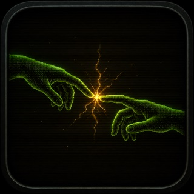
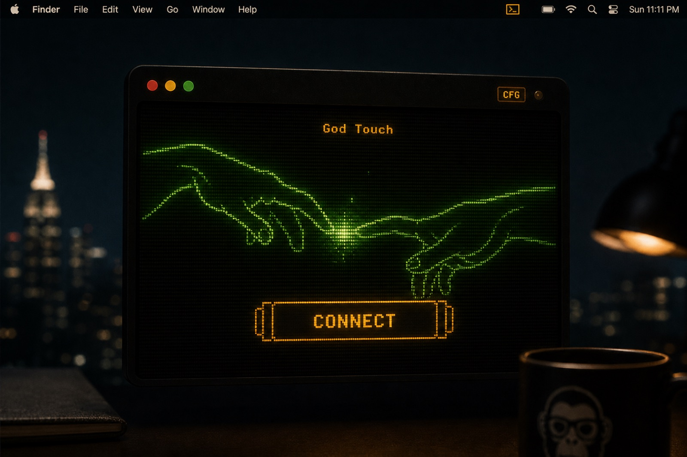
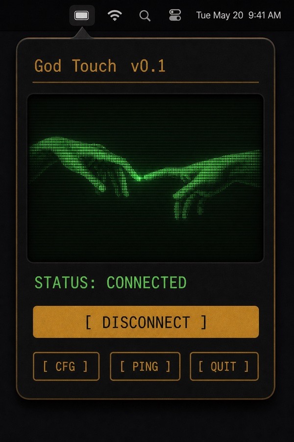
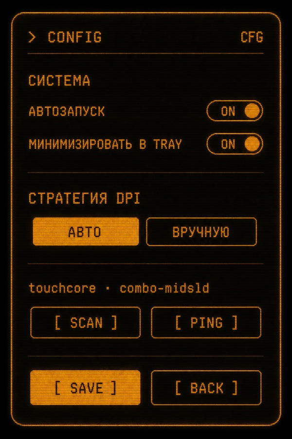
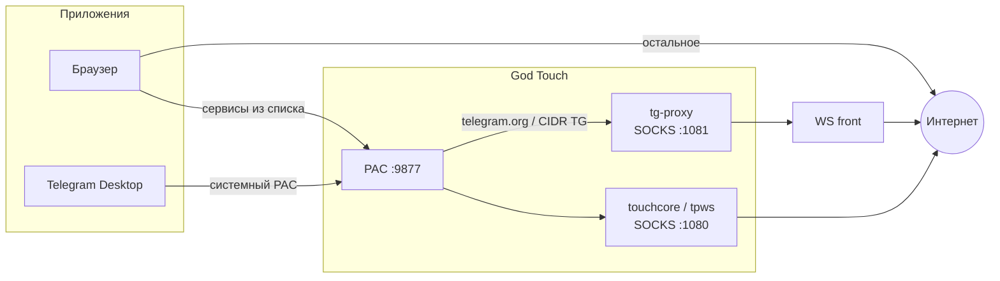

<div align="center">



# God Touch

**Menubar для macOS — стабильнее медиа и мессенджеры, без лишнего трафика через прокси**

<p>
  
  
  
  
  
</p>

Иконка в строке меню → **CONNECT** → выбранные сервисы (YouTube, Discord, Twitch и др. из списка) идут через локальный ускоритель соединения. Telegram — отдельным мостом. Остальной трафик Mac — напрямую.

[Быстрый старт](#-быстрый-старт) · [Установка](#-установка) · [Интерфейс](#-интерфейс) · [Стратегия](#-стратегия-соединения) · [Telegram](#-telegram) · [FAQ](#-faq)

</div>

<p align="center">
  
</p>

---


## ⚡ Быстрый старт

> **30 секунд:** menubar → **CONNECT** → пароль Mac → **CFG → SCAN**.

| | |
| :--- | :--- |
| **1** | `Touch.app` в `/Applications` |
| **2** | Янтарная CRT-иконка в menubar |
| **3** | В статусе `ENG: touchcore · …` |
| **4** | **CFG → SCAN** подбирает быструю рабочую стратегию |
| **5** | После CONNECT подтверди прокси в окне Telegram (или оставь системный прокси) |
| **6** | В браузере включён Secure DNS (DoH) |

<p align="center">
  
  &nbsp;&nbsp;
  
</p>

### Что реально идёт через Touch

| Трафик | Путь | Порт |
| :--- | :--- | :--- |
| Сервисы из списков (медиа, чаты) | PAC → локальный движок (`touchcore` / tpws / …) | `1080` |
| Telegram Desktop | PAC → `tg-proxy` → WebSocket-фронт | `1081` |
| Всё остальное | Напрямую | — |

Touch **не** гоняет весь Mac через прокси. PAC на `:9877` направляет в SOCKS только домены из списков и адреса Telegram.

### Требования

- macOS **14+** (Sonoma и новее)
- **Apple Silicon** (M1–M4)
- Первая сборка с интернетом (~15 мин): Xcode CLT, Homebrew, Go, Rust

### Назначение

Личный инструмент для **ускорения и стабилизации** соединения с привычными сервисами на macOS. Используй в рамках применимого законодательства. Не предназначен для доступа к запрещённым материалам и не является публичным VPN-сервисом.

---

## 📦 Установка

### 1. Инструменты (один раз)

```bash
xcode-select --install
/bin/bash -c "$(curl -fsSL https://raw.githubusercontent.com/Homebrew/install/HEAD/install.sh)"
brew install go rust
```

### 2. Клонировать и собрать

```bash
git clone https://github.com/RSAM1K/GodTouch.git
cd GodTouch
chmod +x scripts/build.sh
./scripts/build.sh
```

Первый запуск собирает `touchcore`, `tpws`, `spoofdpi`, `tg-proxy`. Результат: **`/Applications/Touch.app`**.

### 3. Запуск

```bash
open /Applications/Touch.app
```

### Обновление

```bash
git pull
./scripts/build.sh
```

### Удаление

1. **DISCONNECT** → **QUIT**
2. Удали `/Applications/Touch.app`
3. Системные настройки → Сеть → выключи авто-прокси, если остался `127.0.0.1:9877`

---

## 🖥 Интерфейс

Компактная CRT-панель: янтарный моноширинный текст, фосфорный арт, без иконки в Dock.

| Кнопка | Что делает |
| :--- | :--- |
| **CONNECT / DISCONNECT** | Запускает локальный движок + PAC + мост Telegram. macOS спросит пароль админа. |
| **CFG** | Стратегия, SCAN, автозапуск, CONNECT при старте |
| **PING** | Проверка YouTube, Google, Discord, Twitch, Telegram |
| **QUIT** | Отключает и выходит |

Иконка в menubar: тусклая янтарная — выкл, яркая со искрой — связь есть.

<details>
<summary>Схема двух экранов</summary>

<p>


</p>

</details>

---

## ⚙️ Стратегия соединения

> **SCAN** работает только при включённом **CONNECT**.

### АВТО (рекомендуется)

```
CONNECT  →  CFG → SCAN  →  SAVE
```

SCAN перебирает ~20 комбинаций движка и параметров на YouTube + Google и сохраняет самую быструю рабочую. По умолчанию — **touchcore** (нативный Rust). Если проба падает, Touch может откатиться на эквивалент **tpws**.

### ВРУЧНУЮ

**CFG → СТРАТЕГИЯ → ВРУЧНУЮ** → пресет → параметры → **SAVE**.

| Движок | Когда пробовать | Примеры |
| :--- | :--- | :--- |
| **touchcore** | По умолчанию — тонкая настройка TLS на macOS | `combo-midsld`, `combo-sni` |
| **tpws** | Часто лучший на домашнем Wi‑Fi | `tlsrec-midsld`, `ALT`, `general` |
| **ciadpi** | Медиа нестабильно на tpws | `disorder-sni`, `split-1` |
| **spoofdpi** | Мобильный хотспот | `chunk-1`, `split-sni` |

**[ СБРОС ]** возвращает стратегию в АВТО. После — снова SCAN.

### PING

| Сайт | ✓ | ✗ |
| :--- | :--- | :--- |
| YouTube | Видео грузится | Другой пресет или SCAN |
| Google | Базовая связность | Сеть / DNS |
| Discord | Чат / голос | ВРУЧНУЮ + другой пресет |
| Twitch | Стримы | Проверь DoH в браузере |
| Telegram | `tg-proxy` жив | CONNECT + подтверди прокси в TG |

---

## 📱 Telegram

После **CONNECT** Touch открывает в Telegram окно подтверждения прокси (`127.0.0.1:1081`). Нажми подтвердить.

Если клиент сбросит настройку:

1. Оставь **«Использовать системные настройки прокси»**
2. **IPv6 выключить**
3. Повторно не включай «свой» SOCKS вручную, если окно уже отклоняло его

Чат идёт через WebSocket-фронт. Прямой маршрут к дата-центрам Telegram у части провайдеров нестабилен — для этого и нужен мост.

---

## 🎛 Под себя

### Браузер — Secure DNS

Без DoH имя может резолвиться криво ещё до PAC.

| Браузер | Где | Резолвер |
| :--- | :--- | :--- |
| Chrome | Конфиденциальность → Безопасный DNS | `https://dns.google/dns-query` |
| Firefox | Сеть → DNS через HTTPS | Google / Cloudflare |
| Safari | Системные настройки → Сеть → DNS | `1.1.1.1` или `8.8.8.8` |

### Свои списки сайтов

`Resources/lists/`

```
list-general.txt   # Discord, Instagram, …
list-google.txt    # YouTube, Google, CDN
```

```
discord.com       # суффикс
^dns.google       # точное совпадение
# комментарий
```

Потом `./scripts/build.sh` и перезапуск Touch.

### Свои параметры движка

**CFG → ВРУЧНУЮ** → движок → флаги → **SAVE**

| Движок | Пример |
| :--- | :--- |
| touchcore | `--split-pos midsld --disorder --tlsrec midsld` |
| tpws | `--split-pos=1 --tlsrec=midsld` |
| ciadpi | `-d 1+s` |
| spoofdpi | `--https-chunk-size 1` |

В tpws не смешивай `--oob` и `--disorder`. Сломал — **СБРОС** + SCAN.

---

## 🏗 Архитектура



| Порт | Процесс | Роль |
| :--- | :--- | :--- |
| `1080` | touchcore / tpws / ciadpi / spoofdpi | Локальный SOCKS для списков |
| `1081` | tg-proxy | Telegram → WebSocket-фронт |
| `9877` | PAC | Список → 1080, Telegram → 1081, иначе DIRECT |

---

## 🌿 Ветки

| Ветка | Назначение |
| :--- | :--- |
| `main` | Стабильная |
| `beta` | Эксперименты |

```bash
git checkout beta
# …правки…
git checkout main && git merge --ff-only beta && git push
```

---

## ❓ FAQ

<details>
<summary><strong>YouTube тормозит или не открывается</strong></summary>

CONNECT включён? **PING** по YT. Если ✗ — SCAN заново или другой движок в ВРУЧНУЮ. Включи Secure DNS.

</details>

<details>
<summary><strong>SCAN ничего не нашёл</strong></summary>

Сначала **CONNECT**. Если все стратегии ✗ — попробуй другую сеть (например хотспот): у другого канала параметры другие.

</details>

<details>
<summary><strong>Telegram / «прокси будет отключён»</strong></summary>

Клиент иногда отклоняет кастомный SOCKS. Оставь **системный прокси** и IPv6 выкл. Переподключи Touch — окно подтверждения откроется снова.

</details>

<details>
<summary><strong>Видео в Telegram медленнее YouTube</strong></summary>

Разные маршруты: медиа TG идёт через WebSocket-фронт, YouTube — через локальный движок к CDN. Скорости не обязаны совпадать.

</details>

<details>
<summary><strong>Сайт ломается после CONNECT</strong></summary>

Не добавляй его домен в `list-*.txt`, если он не нужен в ускорителе. GitHub в списках по умолчанию нет.

</details>

<details>
<summary><strong>build.sh падает</strong></summary>

Проверь: `xcode-select -p`, `brew --version`, `go version`, `rustc --version`. Удали `vendor/tpws` и собери снова.

</details>

<details>
<summary><strong>Иконка серая после перезагрузки</strong></summary>

Включи **CONNECT при старте** в CFG или нажми CONNECT вручную.

</details>

---

<div align="center">


**God Touch** · menubar · стабильное соединение для медиа и Telegram

</div>
